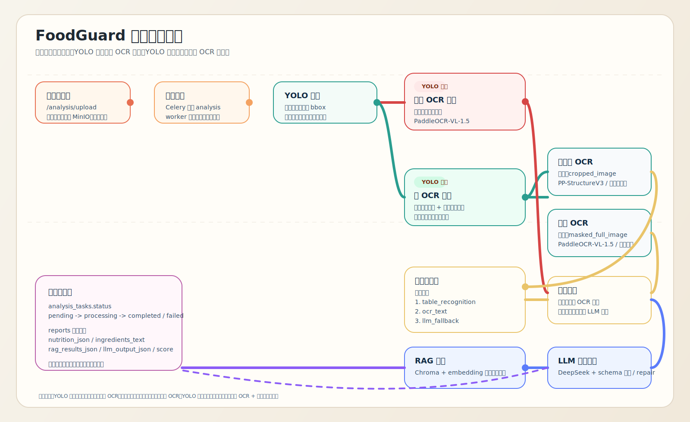

# FoodGuard 后端分析链路详解

更新时间：2026-03-27  
适用范围：`food-label-analyzer` 当前后端实现

## 1. 文档目标

这份文档用于解释 FoodGuard 后端是如何把一张食品标签图片，转换成一份可展示的健康分析报告的。

文档关注的是“当前真实实现”，不是理想设计图。因此这里描述的内容与代码行为保持一致，包括：

- 用户上传图片后任务如何入队
- Celery worker 如何串联 YOLO、OCR、配料提取、营养提取、RAG、LLM
- `YOLO 命中` 和 `YOLO 失败` 两条分支分别怎么处理
- 任务状态、错误处理、重试、落库字段分别是什么

如果你要快速理解全链路，先看第 2 节和第 5 节。  
如果你要对接前端或排查线上问题，优先看第 3 节、第 6 节和第 9 节。

## 2. 总体架构

分析链路的核心目标是：

1. 接收用户上传的食品包装图片。
2. 把图片转成结构化信息：
   - 配料文本
   - 营养成分表
   - RAG 检索结果
3. 再把这些中间结果交给 LLM，输出最终健康分析报告。
4. 把任务状态和报告结果保存到数据库，供前端轮询与展示。

配套电路图在这里：



高层流程可以概括为：

```text
前端上传图片
  -> API 校验文件并创建任务
  -> MinIO 保存原图
  -> Celery 入队
  -> Worker 下载图片
  -> YOLO 检测营养表区域
  -> OCR 分支
  -> 营养 / 配料提取
  -> RAG 检索
  -> LLM 生成健康分析
  -> Report 落库
  -> 前端轮询任务状态并打开报告页
```

## 3. 对外接口视角

### 3.1 上传接口

前端通过：

```text
POST /api/v1/analysis/upload
```

上传图片。

这个接口做四件事：

1. 校验文件类型和大小。
2. 把图片上传到 MinIO。
3. 在数据库中创建 `analysis_tasks` 记录。
4. 通过 Celery 把任务发送到 `analysis.process_image`。

返回内容不是报告本身，而是任务信息：

- `task_id`
- `status=queued`
- `created_at`

### 3.2 任务状态轮询接口

前端通过：

```text
GET /api/v1/analysis/tasks/{task_id}
```

轮询任务进度。

对外状态只有四种：

- `queued`
- `processing`
- `completed`
- `failed`

当任务完成时，返回里会带：

- `report_id`
- `nutrition_parse_source`

前端拿到 `report_id` 后，再请求报告详情接口。

### 3.3 报告详情接口

分析成功后，前端再通过报告接口读取最终结果。  
从用户视角看，整个产品体验是：

```text
上传 -> 分析中 -> 状态完成 -> 打开报告
```

## 4. 关键数据对象

### 4.1 `analysis_tasks`

任务表表示一条“异步分析任务”。

关键字段：

- `id`: 任务 ID
- `user_id`: 任务所属用户
- `image_key`: MinIO 对象键
- `image_url`: 原图 URL
- `status`: `pending / processing / completed / failed`
- `error_message`: 内部错误信息
- `celery_task_id`: Celery 任务 ID
- `completed_at`: 完成时间

### 4.2 `reports`

报告表表示最终生成的一条分析报告。

关键字段：

- `task_id`: 对应任务
- `user_id`: 所属用户
- `ingredients_text`: 提取出来的配料文本
- `nutrition_json`: 营养成分结构化结果
- `nutrition_parse_source`: 营养解析来源
- `rag_results_json`: RAG 检索结果
- `llm_output_json`: LLM 最终输出
- `score`: 0-100 的健康分
- `artifact_urls`: OCR 产物 URL

### 4.3 营养解析来源 `nutrition_parse_source`

当前实现中，营养成分的解析来源有五种：

- `table_recognition`
- `ocr_text`
- `llm_fallback`
- `empty`
- `failed`

这对前端和排障都很重要，因为它直接说明营养表到底是“结构化识别成功”，还是“只靠文本回退”，还是“最后用 LLM 兜底”。

## 5. 从上传到报告的完整执行过程

## 5.1 Step 1: 上传图片并创建任务

上传接口收到文件后，会先做同步校验。

校验内容包括：

- 文件名是否存在
- 文件是否为空
- 文件大小是否超过 `MAX_UPLOAD_SIZE_MB`
- 文件头是否真的是 `jpeg/png/webp`
- Pillow 是否能成功解析图像

只有校验通过，图片才会被上传到 MinIO。

上传成功后，后端立即创建一条 `AnalysisTask`，状态为：

```text
pending
```

然后把任务投递到 Celery 队列 `analysis`。

这一步的设计重点是：

- 上传请求尽快返回，不阻塞在 AI 分析链路上
- 原图先进入对象存储，后续 worker 统一从 MinIO 拉取

## 5.2 Step 2: Celery worker 启动与资源预热

Celery worker 启动时会尝试做以下预热：

- YOLO warmup
- OCR warmup
- RAG warmup
- LLM 配置校验

这里的策略不是“预热失败就退出”，而是：

- 记录 warning
- worker 继续启动

这样做的原因是：某些外部服务临时不可用时，系统仍然可以先起来，后续让具体任务去决定是否重试或失败。

## 5.3 Step 3: 下载原图

真正的分析从 `process_image_task` 开始。

worker 首先根据 `image_key` 从 MinIO 下载原始图片字节流。

如果下载失败：

- 抛出 `StorageServiceError`
- 进入任务重试逻辑

这一步成功后，后续所有图像处理都基于内存中的 `image_bytes` 进行。

## 5.4 Step 4: YOLO 检测营养成分表区域

然后系统会执行 YOLO 检测，目标是定位营养成分表区域。

YOLO 输出只有两种可能：

1. 返回一个 `bbox`
2. 返回 `None`

这里的 `bbox` 结构大致是：

```json
{
  "x1": 3084,
  "y1": 673,
  "x2": 3728,
  "y2": 1593,
  "confidence": 0.67
}
```

### 5.4.1 YOLO 命中后会生成两张图

如果 YOLO 命中了营养表区域，后端不会只拿原图继续做 OCR，而是会生成两路输入：

- `cropped_image`
  - 只保留营养成分表区域
  - 供营养表 OCR 使用
- `masked_full_image`
  - 在原图上把营养表区域涂白
  - 供全图 OCR 使用

这样做的原因是：

- 营养表本身适合单独裁剪后交给表格识别模型
- 全图 OCR 如果继续包含大块营养表，容易让配料、说明文案等非营养信息被表格噪声污染

### 5.4.2 YOLO 失败时的退化策略

如果 YOLO 没有命中，当前实现不会直接任务失败，而是降级为：

- 不跑营养表专用 OCR
- 只跑全图 `PaddleOCR-VL-1.5`
- 后面由营养解析器尝试从 OCR 文本中回退提取营养项

也就是说：

```text
YOLO 失败 != 任务失败
```

系统仍然尽量产出可用报告，只是中间结果质量可能下降。

## 5.5 Step 5: OCR 分支

OCR 是当前后端链路里最核心、也最容易受外部服务波动影响的一步。

### 5.5.1 图像预处理

在发送给远程 OCR 服务之前，系统会先做一次图像预处理：

- 转成 RGB
- 最长边压缩到 `2200`
- 重新编码成 JPEG

这么做的原因非常直接：

- 原图太大时，远程 OCR 更容易超时
- 压缩后传输更快，整体延迟更低

### 5.5.2 YOLO 命中时：双 OCR 并行

如果 YOLO 命中，则进入并行 OCR 模式：

#### A. 处理后的全图 OCR

输入：

- `masked_full_image`

模型：

- `PaddleOCR-VL-1.5`

目标：

- 识别除营养表之外的主要文本
- 服务于配料提取、场景语义、品牌文案等整体分析

输出：

- `OCRTextResult`
  - `raw_text`
  - `lines`
  - `artifact_json_url`

#### B. 裁剪营养表 OCR

输入：

- `cropped_image`

模型：

- `PP-StructureV3`

目标：

- 尽量直接拿到表格结构
- 如果结构化失败，也至少返回营养表区域 OCR 文本

输出：

- `TableRecognitionResult`
  - `table_json`
  - `ocr_fallback_text`
  - `table_html_url`
  - `table_xlsx_url`

当前实现中，`table_html_url` 和 `table_xlsx_url` 字段已经保留，但多数情况下还没有真正填充。

### 5.5.3 YOLO 失败时：只跑全图 OCR

如果 YOLO 失败，则只做：

- 原图全图 OCR

此时：

- `full_text_result` 有值
- `table_result = None`

后面营养解析只能依赖：

- OCR 文本规则解析
- 或 LLM 兜底解析

## 5.6 Step 6: 营养成分解析

营养解析器的输入是：

- `table_result`
- `ocr_fallback_text`

解析优先级固定如下：

### 第一优先级：`table_recognition`

如果表格 OCR 给出了结构化 `table_json`，系统优先从结构化表中提取：

- `name`
- `value`
- `unit`
- `daily_reference_percent`

这是最理想的结果，因为它最接近真正的营养表结构。

### 第二优先级：`ocr_text`

如果结构化表格不完整或没有成功，解析器会尝试从 OCR 文本里做规则匹配。

当前规则包括：

- 营养项别名匹配
- 单位归一化
- `NRV%` 提取
- `每100g / 每份` 等 serving size 提取
- 紧凑文本解析
- 长词优先匹配

所谓“长词优先”非常重要，目的是避免：

- `反式脂肪酸` 被提前匹配成普通 `脂肪`
- `饱和脂肪酸` 被提前匹配成普通 `脂肪`

### 第三优先级：`llm_fallback`

如果规则解析仍然失败，就会调用 DeepSeek 做 JSON 兜底。

兜底时：

- prompt 会要求模型“只返回合法 JSON”
- 解析器会清理 fenced JSON
- 再用 `NutritionData` schema 做校验

如果 LLM 仍失败，则返回：

- `parse_method=failed`

### 空结果和失败结果

如果既没有表格结果，也没有 OCR 文本，则返回：

- `parse_method=empty`

如果有输入，但最终仍然没有可用结构，则返回：

- `parse_method=failed`

## 5.7 Step 7: 配料提取

配料提取只依赖 `full_text`。

这里的设计重点是：

- 当 YOLO 命中时，`full_text` 来自“去掉营养表区域后的全图 OCR”
- 这样可以减少营养表对配料提取的干扰

### 配料提取策略

优先走规则提取：

1. 在全文中定位触发词，例如：
   - `配料`
   - `原料`
   - `成分`
2. 找到配料段落后，遇到停止词就截断，例如：
   - `净含量`
   - `生产日期`
   - `营养成分`
3. 再对配料做切分和复合成分展开

例如：

```text
复合调味料（食盐、味精）
```

会被展开成：

- 复合调味料
- 食盐
- 味精

如果规则提取失败，则回退到 LLM 提取。

输出有两个：

- `ingredient_terms`
- `ingredients_text`

## 5.8 Step 8: RAG 检索

RAG 的目标不是直接生成报告，而是给 LLM 提供更可靠的配料与标准信息补充。

当前实现是：

- 使用 Ollama `/api/embed` 生成 embedding
- 在 ChromaDB 中检索
  - 配料集合
  - 标准集合
- 最终组合成 `retrieval_results`

检索结果的每一项都会标记：

- `retrieved`
- `match_quality`
- `matches`
- `similarity_score`

如果 `ingredient_terms` 为空，但 `ingredients_text` 仍然有内容，系统会尝试用整段文本做一次回退检索。

## 5.9 Step 9: LLM 生成健康分析

最后，系统把以下三部分输入交给 DeepSeek：

- `full_text`
- `nutrition_json`
- `rag_results_json`

LLM 的职责是生成最终用户可读的健康分析，包括：

- `score`
- `summary`
- `hazards`
- `benefits`
- `ingredients`
- `health_advice`

### 输出校验

LLM 输出不是直接信任的，而是先走 schema 校验：

- JSON 是否可解析
- 结构是否符合 `FoodHealthAnalysisOutput`
- `health_advice` 是否覆盖所有规定人群

### 修复机制

如果 LLM 第一次返回不合法 JSON 或字段不完整，系统不会立刻失败，而是会进入 repair 流程：

1. 把原始输入、验证错误、上次错误输出拼成 repair prompt
2. 再次调用模型
3. 直到修复成功或超过最大重试次数

如果 repair 仍然失败，则抛出 `LLMServiceError`。

## 5.10 Step 10: 落库与任务完成

当营养、配料、RAG、LLM 四类结果都齐备后，worker 会把它们写入 `reports` 表。

落库内容包括：

- `ingredients_text`
- `nutrition_json`
- `nutrition_parse_source`
- `rag_results_json`
- `llm_output_json`
- `score`
- `artifact_urls`

然后把任务状态改成：

```text
completed
```

并写入 `completed_at`。

如果同一个任务此前已经有报告，则会更新已有报告，而不是重复创建多份。

## 6. 状态流转与前端可见行为

内部任务状态：

- `pending`
- `processing`
- `completed`
- `failed`

对外状态映射为：

- `pending -> queued`
- `processing -> processing`
- `completed -> completed`
- `failed -> failed`

前端轮询接口除了返回状态，还会附带：

- `progress_message`
- `report_id`
- `nutrition_parse_source`
- 脱敏后的 `error_message`

这意味着前端可以做如下增强：

- 在报告页提示“营养表来自结构化识别还是文本回退”
- 在失败页给出更稳定的用户提示，而不是直接暴露内部异常

## 7. 重试、超时与错误处理

## 7.1 Celery 级超时

当前任务配置：

- `soft_time_limit = 270s`
- `time_limit = 300s`

如果超过软超时：

- 任务会被标记为 `failed`
- 返回 `Analysis timeout`

## 7.2 可重试错误

以下错误会进入 Celery 重试逻辑：

- `OCRServiceError`
- `LLMServiceError`
- `StorageServiceError`
- `EmbeddingServiceError`

当前最大重试次数：

- `max_retries = 2`

重试间隔：

- `countdown = 10s`

## 7.3 不可重试错误

以下情况通常直接失败：

- `NotImplementedError`
- 其他未预期异常

## 7.4 对外错误脱敏

任务状态接口不会把内部错误原样返回给前端，而是做了脱敏映射，例如：

- timeout -> “任务处理超时，请重新上传”
- OCR 相关 -> “OCR 子系统暂时不可用，请稍后重试”
- retry 相关 -> “服务暂时繁忙，请稍后重试”

## 8. 当前实现里的关键设计选择

## 8.1 为什么 YOLO 命中后要“裁剪图 + 去表全图”双路并行

这是当前实现里最关键的链路优化。

原因有三点：

1. 营养表需要专用表格模型处理，裁剪后效果更稳定。
2. 全图 OCR 如果保留营养表，大段表格文本会污染配料提取和全文语义。
3. 双路并行比串行更节省总耗时。

## 8.2 为什么 YOLO 失败后不直接报错

因为营养表定位不是整个任务唯一入口。  
即使没有 bbox，系统仍然可能从全图 OCR 中恢复出：

- 配料信息
- 局部营养项目
- 足够支持 LLM 生成一个退化但可用的报告

## 8.3 为什么要先压缩图片再送 OCR

这是为了解决大图远程 OCR 超时问题。

当前样例图已经验证过：

- 原始 4000+ 像素大图更容易触发远程超时
- 压缩后全图 OCR 返回明显更稳定

## 8.4 为什么 LLM 输出必须强校验

因为报告结果要直接面向用户展示，不能接受任意自由文本。

强校验的价值在于：

- 保证字段完整
- 保证分值范围合法
- 保证针对不同人群的 `health_advice` 不缺项

## 9. 当前已知限制

这份文档解释的是“当前实现”，因此也需要明确当前限制。

### 9.1 OCR 仍依赖外部服务稳定性

远程 PaddleOCR 服务偶尔会出现：

- read timeout
- 代理断连
- 远端关闭连接

所以当前链路虽然已经做了压缩、并行和分支优化，但仍然受外部 OCR 服务稳定性影响。

### 9.2 表格产物 URL 预留但尚未完全利用

`TableRecognitionResult` 里保留了：

- `table_html_url`
- `table_xlsx_url`

但当前大多数场景下还没有形成完整可消费产物链路。

### 9.3 部分文案与 prompt 文件仍有历史编码痕迹

仓库中部分提示词和老文件存在编码污染，这不会阻断主链路运行，但会增加维护成本。  
后续如果要做长期维护，建议统一做一次文本清理。

## 10. 推荐阅读顺序

如果你是第一次接手这个后端，建议按下面顺序读代码：

1. `app/api/v1/analysis.py`
2. `app/services/task_service.py`
3. `app/tasks/analysis_task.py`
4. `app/workers/yolo_worker.py`
5. `app/workers/ocr_worker.py`
6. `app/workers/extractor/nutrition_extractor.py`
7. `app/workers/extractor/ingredient_extractor.py`
8. `app/workers/rag_worker.py`
9. `app/workers/llm_worker.py`
10. `app/models/analysis_task.py` 与 `app/models/report.py`

这样读，最容易把“接口层 -> 编排层 -> 能力层 -> 数据层”串起来。

## 11. 一句话总结

FoodGuard 当前后端分析链路的核心思想是：

```text
把食品标签图片拆成“任务编排 + 定位 + OCR + 规则提取 + RAG + LLM”六层，
在 YOLO 成功时走双 OCR 并行提升质量，
在 YOLO 或表格识别失败时保留回退链路，尽量把一次上传变成一份可用报告。
```
